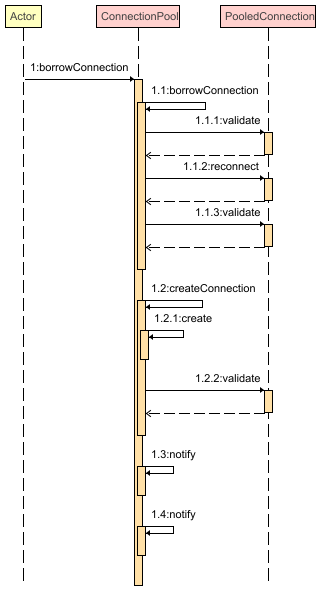
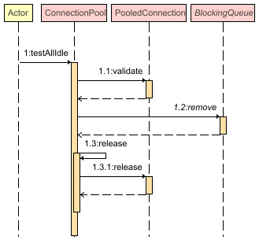

# 摘要

数据库连接池组件已经成为服务端应用中进行数据库连接管理在事实上的标准方案。而引入新组件的同时自然也引入了更多的风险。本文尝试解决一个由连接池版本升级引发驱动程序抛出NullPointerException导致项目无法启动的问题。以异常堆栈作为排查依据，通过查看源码和构建复现场景的手段确认问题发生的根本原因，并尝试在该问题涉及到的不同层面提出合理可行的解决方案。进一步的，还继续深入研究了其他连接池的相关实现，以分析其没有引发该异常的原因。

<!-- more -->

# 1 现象描述

将项目中使用的Druid连接池版本从1.1.22升级到1.2.15后项目无法启动。

异常堆栈如下（省略部分spring堆栈并隐去部分信息）：

```
{dataSource-49} init error
java.sql.SQLException: validateConnection false
	at com.alibaba.druid.pool.DruidAbstractDataSource.validateConnection(DruidAbstractDataSource.java:1461) ~[druid-1.2.15.jar:?]
	at com.alibaba.druid.pool.DruidAbstractDataSource.createPhysicalConnection(DruidAbstractDataSource.java:1812) ~[druid-1.2.15.jar:?]
	at com.alibaba.druid.pool.DruidDataSource.init(DruidDataSource.java:914) [druid-1.2.15.jar:?]
	at com.alibaba.druid.pool.DruidDataSource.getConnection(DruidDataSource.java:1433) [druid-1.2.15.jar:?]
	
Caused by: java.lang.NullPointerException
	at com.mysql.jdbc.StatementImpl$CancelTask.<init>(StatementImpl.java:95) ~[mysql-connector-java-5.1.30.jar:?]
	at com.mysql.jdbc.StatementImpl.executeQuery(StatementImpl.java:1541) ~[mysql-connector-java-5.1.30.jar:?]
	at sun.reflect.NativeMethodAccessorImpl.invoke0(Native Method) ~[?:1.8.0_281]
	at sun.reflect.NativeMethodAccessorImpl.invoke(NativeMethodAccessorImpl.java:62) ~[?:1.8.0_281]
	at sun.reflect.DelegatingMethodAccessorImpl.invoke(DelegatingMethodAccessorImpl.java:43) ~[?:1.8.0_281]
	at java.lang.reflect.Method.invoke(Method.java:498) ~[?:1.8.0_281]
	at com.mysql.jdbc.LoadBalancingConnectionProxy$ConnectionErrorFiringInvocationHandler.invoke(LoadBalancingConnectionProxy.java:107) ~[mysql-connector-java-5.1.30.jar:?]
	at com.sun.proxy.$Proxy164.executeQuery(Unknown Source) ~[?:?]
	at com.alibaba.druid.pool.vendor.MySqlValidConnectionChecker.isValidConnection(MySqlValidConnectionChecker.java:140) ~[druid-1.2.15.jar:?]
	at com.alibaba.druid.pool.DruidAbstractDataSource.validateConnection(DruidAbstractDataSource.java:1440) ~[druid-1.2.15.jar:?]
	... 118 more
```

# 2 配置收集

作为底层服务的维护人员，当上层的使用方报告问题时，首先要做的就是尽可能完整的收集相关信息以复现问题。在这个问题中，收集了从连接池到MySQL服务器之间的各层组件的版本及配置信息。

1. Druid连接池版本：1.1.22和1.2.15

2. Druid连接池配置（根据后续的排查情况，此处省略部分不相关配置项）：

   ```json
   {
     "initialSize": 10,
     "maxActive": 50,
     "minIdle": 10,
     "maxWait": 3000,
     "validationQuery": "SELECT 1",
     "validationQueryTimeout": 3000,
     "testOnBorrow": false,
     "testOnReturn": false,
     "testWhileIdle": true,
     "timeBetweenEvictionRunsMillis": 60000,
     "minEvictableIdleTimeMillis": 30000,
     "maxEvictableIdleTimeMillis": 100000
   }
   ```

3. MySQL Connector/J连接方式：连接协议为`jdbc:mysql:fabric://`，对应的Driver实现类为`com.mysql.fabric.jdbc.FabricMySQLDriver`，由Driver构造出的Connection实现类为`com.mysql.fabric.jdbc.FabricMySQLConnectionProxy`(主要逻辑)和`com.mysql.fabric.jdbc.JDBC4FabricMySQLConnectionProxy`。

4. MySQL Connector/J驱动版本：5.1.49版本。（实际项目使用的是经过二次开发的5.1.30版本，但经后续测试，直至最新的5.1.49版本的驱动都存在该问题）

5. MySQL服务：5.7版本。使用Fabric服务作为集群管理方案。

# 3 异常复现

根据上述配置，构造Druid连接池实例，并调用方法获取连接，即可复现该异常

```java
public static void main(String[] args) throws Exception {
        Properties properties = new Properties();
        properties.put("url", "jdbc:mysql:fabric://");
        properties.put("username", "username");
        properties.put("password", "password");
        properties.put("driverClassName", "com.mysql.fabric.jdbc.FabricMySQLDriver");

        properties.put("initialSize", "10");
        properties.put("maxActive", "50");
        properties.put("minIdle", "10");
        properties.put("maxWait", "3000");
        properties.put("validationQuery", "SELECT 1");
        properties.put("validationQueryTimeout", "3000");
        properties.put("testOnBorrow", "false");
        properties.put("testOnReturn", "false");
        properties.put("testWhileIdle", "true");
        properties.put("timeBetweenEvictionRunsMillis", "60000");
        properties.put("minEvictableIdleTimeMillis", "30000");
        properties.put("maxEvictableIdleTimeMillis", "100000");

        DruidDataSource dataSource = new DruidDataSource();
        DruidDataSourceFactory.config(dataSource, properties);

        dataSource.getConnection(); // 抛出异常
    }
```

可以看到与实际项目的异常堆栈相同：

```
{dataSource-1} init error
java.lang.NullPointerException: null
	at com.mysql.jdbc.StatementImpl$CancelTask.<init>(StatementImpl.java:95) ~[mysql-connector-java-5.1.30.jar:?]
	at com.mysql.jdbc.StatementImpl.executeQuery(StatementImpl.java:1546) ~[mysql-connector-java-5.1.30.jar:?]
	at sun.reflect.NativeMethodAccessorImpl.invoke0(Native Method) ~[?:1.8.0_202]
	at sun.reflect.NativeMethodAccessorImpl.invoke(NativeMethodAccessorImpl.java:62) ~[?:1.8.0_202]
	at sun.reflect.DelegatingMethodAccessorImpl.invoke(DelegatingMethodAccessorImpl.java:43) ~[?:1.8.0_202]
	at java.lang.reflect.Method.invoke(Method.java:498) ~[?:1.8.0_202]
	at com.mysql.jdbc.LoadBalancingConnectionProxy$ConnectionErrorFiringInvocationHandler.invoke(LoadBalancingConnectionProxy.java:107) ~[mysql-connector-java-5.1.30.jar:?]
	at com.sun.proxy.$Proxy21.executeQuery(Unknown Source) ~[?:?]
	at com.alibaba.druid.pool.DruidAbstractDataSource.validateConnection(DruidAbstractDataSource.java:1476) ~[druid-1.2.15.jar:?]
	at com.alibaba.druid.pool.DruidAbstractDataSource.createPhysicalConnection(DruidAbstractDataSource.java:1812) ~[druid-1.2.15.jar:?]
	at com.alibaba.druid.pool.DruidDataSource.init(DruidDataSource.java:914) [druid-1.2.15.jar:?]
	at com.alibaba.druid.pool.DruidDataSource.getConnection(DruidDataSource.java:1433) [druid-1.2.15.jar:?]
	at com.alibaba.druid.pool.DruidDataSource.getConnection(DruidDataSource.java:1429) [druid-1.2.15.jar:?]
	at main(Test.java:34) [classes/:?]
```

# 4 排查过程

该异常是由升级Druid连接池引起的，因此首先考虑是新版本连接池对驱动程序的不当使用导致了异常。

## 4.1 首先从连接池层面排查版本升级后抛出异常的原因

跟踪异常堆栈中连接池的相关方法调用

```
at com.alibaba.druid.pool.vendor.MySqlValidConnectionChecker.isValidConnection(MySqlValidConnectionChecker.java:140) ~[druid-1.2.15.jar:?]
at com.alibaba.druid.pool.DruidAbstractDataSource.validateConnection(DruidAbstractDataSource.java:1440) ~[druid-1.2.15.jar:?]
```

查看`MySqlValidConnectionChecker.isValidConnection`的验证逻辑

```java
Statement stmt = null;
ResultSet rs = null;
try {
    stmt = conn.createStatement();
    if (validationQueryTimeout > 0) {
        stmt.setQueryTimeout(validationQueryTimeout);
    }
    rs = stmt.executeQuery(query); // 此处抛出NPE
    return true;
} finally {
    JdbcUtils.close(rs);
    JdbcUtils.close(stmt);
}
```

继续查看外层`com.alibaba.druid.pool.DruidAbstractDataSource#validateConnection`对异常的处理

```java
if (validConnectionChecker != null) {
    boolean result;
    Exception error = null;
    try {
        result = validConnectionChecker.isValidConnection(conn, validationQuery, validationQueryTimeout);

        if (result && onFatalError) {
            lock.lock();
            try {
                if (onFatalError) {
                    onFatalError = false;
                }
            } finally {
                lock.unlock();
            }
        }
    } catch (SQLException ex) {
        throw ex;
    } catch (Exception ex) {
        result = false; // 在1.1.22版本中没有这句，因此升级之前没有抛出异常
        error = ex;
    }

    if (!result) {
        SQLException sqlError = error != null ? //
            new SQLException("validateConnection false", error) //
            : new SQLException("validateConnection false");
        throw sqlError; // 抛出异常
    }
```

对比升级前后两个版本可以看出，1.2.15版本对于非SQLException异常也向上抛出，而在旧的1.1.22版本对于非SQLException的异常没有抛出（从实现逻辑推测应该是实现上的bug）。

因此，**虽然是升级连接池版本后出现的异常，但异常实际是由驱动程序抛出，连接池只是将异常进行向上传递。**

## 4.2 继续跟踪驱动程序抛出NullPointerException的原因

跟踪异常堆栈中与驱动程序相关的部分

```
at com.mysql.jdbc.StatementImpl$CancelTask.<init>(StatementImpl.java:95) ~[mysql-connector-java-5.1.xx.jar:?]
at com.mysql.jdbc.StatementImpl.executeQuery(StatementImpl.java:1546) ~[mysql-connector-java-5.1.xx.jar:?]
```

首先看`com.mysql.jdbc.StatementImpl.CancelTask`构造方法：

```java
CancelTask(StatementImpl cancellee) throws SQLException {
    connectionId = cancellee.connectionId;
    origHost = connection.getHost();
    toCancel = cancellee;
    origConnProps = new Properties();

    Properties props = StatementImpl.this.connection.getProperties(); // 此处connection.getProperties()返回了null

    Enumeration<?> keys = props.propertyNames(); // 导致此处抛出NPE异常

    while (keys.hasMoreElements()) {
        String key = keys.nextElement().toString();
        origConnProps.setProperty(key, props.getProperty(key));
    }

    origConnURL = connection.getURL();
}
```

可以看出是由于所使用的Connection实现类`com.mysql.fabric.jdbc.FabricMySQLConnectionProxy`的`getProperties()`方法返回null导致了异常。

继续看`com.mysql.jdbc.StatementImpl#executeQuery`中进行`CancelTask`实例构造的相关代码

```java
if (locallyScopedConn.getEnableQueryTimeouts() && // 这个连接配置项的默认值为true
        this.timeoutInMillis != 0
        && locallyScopedConn.versionMeetsMinimum(5, 0, 0)) {
    timeoutTask = new CancelTask(this); // 该方法中产生NPE异常
    locallyScopedConn.getCancelTimer().schedule(timeoutTask,
                                                this.timeoutInMillis);
}
```

可以看出，**当启用了请求超时并且配置了超时时间，会构造并调度`CancelTask`实例，在构造`CancelTask`实例时，需要用到连接对象的`getProperties()`方法，由于`FabricMySQLConnectionProxy`类对于该方法的实现是直接返回null，因此触发了NPE**。

结合`CancelTask`的`run()`方法中也可以看出，这是驱动层面对请求超时功能的实现：另起定时任务，在请求达到超时时间后，另起一个连接，kill掉之前的请求，则之前的查询请求会异常返回。

综上可以总结在驱动层面触发该异常的原因：**使用Fabric连接方式执行带有超时设置的查询**。

结论验证：调用驱动程序构造Fabric方式的连接并执行带有超时设置的查询。

```java
public static void main(String[] args) throws Exception {
    Class.forName("com.mysql.fabric.jdbc.FabricMySQLDriver");
    Connection connection = DriverManager.getConnection("jdbc:mysql:fabric://", "username", "password"); // enableQueryTimeouts配置默认开启
    Statement statement = connection.createStatement();
    statement.setQueryTimeout(10);
    statement.executeQuery("select 1"); // 应在此处抛出异常
}
```

异常复现

```
Exception in thread "main" java.lang.NullPointerException
	at com.mysql.jdbc.StatementImpl$CancelTask.<init>(StatementImpl.java:95)
	at com.mysql.jdbc.StatementImpl.executeQuery(StatementImpl.java:1546)
	at sun.reflect.NativeMethodAccessorImpl.invoke0(Native Method)
	at sun.reflect.NativeMethodAccessorImpl.invoke(NativeMethodAccessorImpl.java:62)
	at sun.reflect.DelegatingMethodAccessorImpl.invoke(DelegatingMethodAccessorImpl.java:43)
	at java.lang.reflect.Method.invoke(Method.java:498)
	at com.mysql.jdbc.LoadBalancingConnectionProxy$ConnectionErrorFiringInvocationHandler.invoke(LoadBalancingConnectionProxy.java:107)
	at com.sun.proxy.$Proxy21.executeQuery(Unknown Source)
	at main(Test.java:21)
```

## 4.3 结合连接池和驱动程序确定异常发生的原因

上面分别从连接池和驱动程序两个层面分析了异常的产生原因：

1. 驱动程序层面：使用Fabric连接方式执行带有超时设置的查询导致抛出异常
2. 连接池层面：无特殊处理逻辑，仅是将驱动程序抛出的异常向上传递

要最终确定结论，还需要将两者结合，即**连接池和驱动程序的交互逻辑**。

回到连接池`MySqlValidConnectionChecker.isValidConnection`方法，可以看出连接可用性检测的实现正是使用了驱动程序的queryTimeout功能，因此触发了NPE。

总结异常的发生原因：**Druid连接池在对连接进行可用性检测时，使用了驱动程序的queryTimeout功能，由于Fabric连接的实现类未支持超时相关的能力，因此抛出异常。**

异常复现：根据上述结论可知，只需要配置连接池的可用性检测能力，即可触发异常

```json
{
  "validationQuery": "SELECT 1",
  "validationQueryTimeout": 3000
}
```

手动构造异常场景如下：

```java
public static void main(String[] args) throws Exception {
    Properties properties = new Properties();
    properties.put("url", "jdbc:mysql:fabric://");
    properties.put("username", "username");
    properties.put("password", "password");
    properties.put("driverClassName", "com.mysql.fabric.jdbc.FabricMySQLDriver");

    properties.put("validationQuery", "SELECT 1");
    properties.put("validationQueryTimeout", "3000");

    DruidDataSource dataSource = new DruidDataSource();
    DruidDataSourceFactory.config(dataSource, properties);

    dataSource.getConnection();
}
```

# 5 解决方案

遵循异常排查的方向，也从两个方向考虑解决方案：

1. 修改驱动程序
2. 连接池配置变更

## 5.1 修改驱动程序

跟踪官方版本，直到官方支持的最新5.1.49版本，都没有解决该问题。在官方论坛发帖，官方回复已不再支持5.1版本的驱动程序更新。

## 5.2 连接池配置变更

回顾问题产生的原因，在驱动程序中执行超时时间≠0的查询时会出现问题，查询语句和超时时间分别对应连接池的`validationQuery`和`validationQueryTimeout`配置，即当同时配置连接池的`validationQuery`查询语句和`validationQueryTimeout`>0时会引发异常。因此只需要任意破坏一个条件即可。

一个直观的解决方案是配置`validationQueryTimeout`=0即可。从实际执行流程看，可用性检测的sql语句一般都配置的比较简单，因此不会在执行时间上花费很长的时间，更常见的情况是MySQL服务异常导致连接不可用，而此时异步线程也无法连接上MySQL服务。因此该方案可行。

关于`validationQuery`配置的修改方案，通过查看`com.mysql.jdbc.StatementImpl#executeQuery`方法中的相关代码。

```java
if (sql.charAt(0) == '/') {
   if (sql.startsWith(PING_MARKER)) { // PING_MARKER = "/* ping */"
      doPingInstead();
   
      return this.results;
   }
}
```

可以看到以`/* ping */`开头的查询会被转换为特殊实现的ping方法。

配置`validationQuery=/* ping */ SELECT 1`并进行测试，`doPingInstead()`中会向Fabric连接实现类中的封装的`ReplicationConnection`进行可用性检测，不会发生异常。

# 6 为什么使用Tomcat连接池不会出现异常

通过变更配置的方式解决了该问题后，自然的想到了，其他连接池是怎么处理。由于目前项目中主要使用的是Druid和Tomcat两种连接池，因此仅探究Tomcat连接池在连接可用性检测方面的相关实现。

连接池根据`testOnBorrow`，`testOnReture`，`testWhileIdle`的配置，在对应场景执行连接可用性检测。

连接可用性检测相关逻辑在`org.apache.tomcat.jdbc.pool.PooledConnection#validate(int, java.lang.String)`中，可以看到当连接不可用时该方法会返回false。因此要继续看上层的处理逻辑。

## 6.1 testOnBorrow场景

该场景下对连接的可用性检测由`org.apache.tomcat.jdbc.pool.DataSourceProxy#getConnection()`触发进入`org.apache.tomcat.jdbc.pool.ConnectionPool#borrowConnection(int, java.lang.String, java.lang.String)`中。时序图如下：



在1.1中，首先验证连接可用性（失败并返回false），尝试重新连接并再次进行可用性检测（再次失败并返回false），最终抛出异常。

```java
//validation failed.
throw new SQLException("Failed to validate a newly established connection.");
```

在1.2中，由于1.1抛出了异常，因此会尝试重新建立一个连接(1.2.1)，并再次验证连接可用性(1.2.2)，但此时的可用性验证是连接创建场景，因此使用的是initSQL配置或`connection.isValid()`方法，由于未配置initSQL参数且Fabric未实现该方法，因此1.2.2成功返回，继而该连接能够成功返回。

```java
con.validate(PooledConnection.VALIDATE_INIT) // 不同VALIDATE模式的验证逻辑可能不同
```

## 6.2 testWhileIdle场景

testWhileIdle场景由`org.apache.tomcat.jdbc.pool.ConnectionPool.PoolCleaner#run`定时线程触发执行`org.apache.tomcat.jdbc.pool.ConnectionPool#testAllIdle`对连接池中的空闲线程进行检测，时序图如下：



1.1中调用的检测方法依然是`org.apache.tomcat.jdbc.pool.PooledConnection#validate(int, java.lang.String)`，因此检测结果依然是false。对于检测为不可用的连接，则触发1.2和1.3对连接进行释放。

这就导致了当触发定时检测时，所有未使用中的连接都会被抛弃。虽然对功能无影响，但频繁的释放和创建连接对性能有一定影响。

## 6.3 testOnReturn场景

使用场景不多，但易得，调用的检测方法也是相同的，并且也会对连接进行抛弃。最后导致每个连接都只能被使用一次就销毁。

# 7 引申：是否可以在驱动程序层面解决这个问题

根据前面的分析可以看出，该问题**最直接的原因在于Fabric连接未实现超时机制需要调用的相关方法**，因此如果想在驱动程序层面解决该问题，最直接的想法就是对Fabric实现类中的对应方法进行实现。

## 7.1 修改Fabric连接类支持超时机制

可以从`CancelTask`类的相关方法看到，超时机制的实现思路就是在构建时记录下`Connection`对象和`Connection`的连接快照信息，在发生超时后根据这些信息在相应的服务器上执行`kill query`指令。

查看代码可以看到在执行中可能需要调用`Connection`对象的`realClose()`、`duplicate()`、`getURL()`、`getProperties()`来。

考虑`getURL()`、`getProperties()`等快照信息获取方法在不同使用场景下的实现要求：

1. 在超时机制使用场景下，这些方法应该要能够明确的指示出当前实际的连接信息。
2. 在通用场景下，这些方法应该能够指示出当前Fabric连接对象的生成信息。

也就是说这些方法在实现上受限于特定场景和通用场景的矛盾。因此使用该方案支持超时机制不是很合适。

## 7.2 修改超时机制的实现方式

由于当前流程执行不通，因此考虑在上级流程中进行修改。

例如，可以把生成`CancelTask`实例的职责委托给具体的`Connection`类，则Fabric连接实现类可以构建自己的`CancelTask`子类来实现超时机制处理方案。

# 8 总结

本文从源码层面分析了一个由Druid连接池版本升级暴露出的5.1版本MySQL驱动程序NullPointerException的产生原因。并基于异常的产生原因和驱动程序发展现状，采用连接池配置变更的方式解决该问题，并在理论上讨论了驱动程序源码修改的解决方案。

分层是目前程序设计的最基本思想。因此在出现问题时，也可以以各层为边界进行排查；同样的，在解决问题时，也可以以各层为单位寻求合适的解决方案。