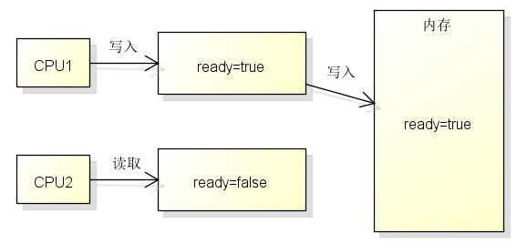
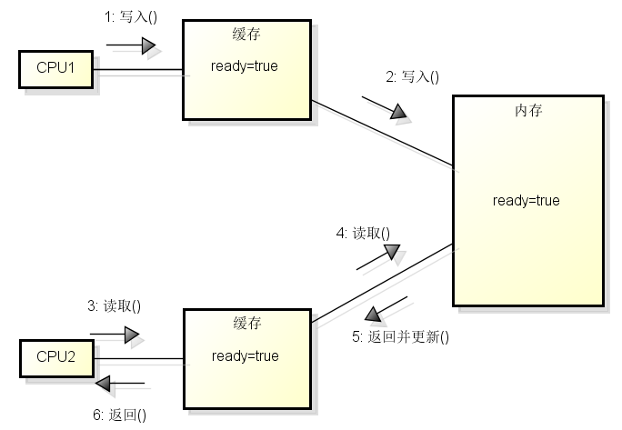

# 摘要

本文从并发安全性的定义出发，描述了什么是安全性，以及Java中对线程安全类的定义。然后列举了几个常见的安全性问题，并根据这些问题提出了**安全性问题的产生条件是不恰当地对共享可变资源进行并发访问**。接着针对该产生条件提出了基本解决思路，并简单地演示了Java提供的应对安全性问题的工具的基本使用方式。

<!-- more -->

# 1 安全性问题的定义

安全性的**核心是正确性**。

当多个线程并发执行时，如果执行结果的正确性，依赖于运行时环境的调度方式，就出现了安全性问题。

在Java中，对于一个类来说，当多个线程并发访问该类的同一个实例时，在没有任何额外的同步和协同的情况下，若不论运行时环境采用何种调度方式、这些线程如何交替执行，所有对这个实例的操作都能表现出预期的行为，则称这个类是线程安全的，即无安全性问题。

# 2 安全性问题示例

## 2.1 先检查后执行

先检查后执行指的是，对一个资源的写入操作依赖于该资源的当前值。如果对这种操作不加以控制，当多个线程交替执行时，就有可能出现问题。

i++操作就是一个经典的先检查后执行的示例。

```java
private static int i = 0;

public void inc(){
    i++;
}
```

当并发地执行上述代码片段时，多个线程会并发地对共享变量i所在的内存地址进行可分割的"读取-修改-写入"操作，在**特定的时序条件**下，就可能出现部分线程的操作被覆盖的问题。


容易想到，只要将"读取-修改-写入"操作**变为不可分割的一个完整操作**，就可以解决该问题。

## 2.2 高速缓存导致的数据失效

```java
private static boolean ready;
private static int number;

new Thread(()->{
    while(!ready)
        Thread.yield();
    System.out.println(number);
}).start();

new Thread(()->{
    number=2;
    ready=true;
}).start();
```

读线程可能会永远循环下去，因为它永远都看不到ready的值发生改变，而是始终在使用已经失效的ready字段的数据。



容易看出，只要能将对数据更新通知到其他使用者，即可解决不可见问题。

## 2.3 重排序导致的数据失效

在上一个代码片段中，在运行时，处理器可能会出现先更新ready值，再更新number值。因为从单线程的执行结果上来看，无论先更新哪个值，最终的结果都是正确的。但是另一个线程并不知道这个情况，因此如果在更新ready值之后，执行线程切换，那么读线程看到number的值为0。这种运行时对指令的执行顺序进行调整的情况事前几乎无法判断。

容易想到，只要能禁止编译器、处理器或运行时对指令的执行顺序进行调整，即可解决这类不可见问题。

# 3 安全性问题的解决方案

出现安全性问题的根本原因在于**不恰当地对共享可变资源进行并发访问**。只有同时满足这几个条件时，才会存在安全性问题。

因此，要解决安全性问题，只需要破坏其中任一条件即可。

## 3.1 并发访问

当程序在**单线程环境运行**时，所有的资源在逻辑上都成为了线程独享的，即使这些对象在堆上生成，感觉也像是在线程栈中生成的一样。因为没有其他线程能够操作，因此就不会出现安全性问题。

## 3.2 可变资源

在“先检查后执行”问题中，变量i是一个可变的，多个线程可以同时对它随意读写。

在一些场景中，可以**将共享变量设置为不可变**（即使用final关键字修饰）。对于不可变资源，由于无法进行更新，只能进行读取，因此总是安全的。

## 3.3 共享资源

比将程序改为串行的方式更进一步，在运行时将数据**限制在当前线程中**，例如方法中的局部变量，通过ThreadLocal实现的线程封闭。这些数据不会被多个线程同时操作，因此就不存在安全性问题。

## 3.4 不恰当访问

更多的情况下，我们使用并发，就代表着我们是真的需要并发，真的需要同时操作共享数据。比如计数器资源，单例资源等等。那么就只能对资源的并发访问进行**适当的同步**，使得这些资源在并发访问的场景下能得到符合预期的结果。

# 4 同步

安全性问题最终都可以归结为两个方面的问题：**多个应该被一次性执行完的指令被分开执行导致资源呈现中间状态的原子性问题**，和**不同线程没有及时了解到数据变更的可见性问题**。

因此，解决不恰当访问问题的基本方法在于解决原子性和可见性的问题。即**操作非原子**和**修改不可见**的问题。Java提供了加锁和声明volatile变量的方式来解决这两个问题。

## 4.1 加锁

**需要一次性执行完的指令片段被称为临界区**。通过对临界区进行加锁，保证每次只有一个线程能执行这些操作，且能够一次性执行完这些操作。同时，下一个进入获得锁进入临界区的线程，能够完整地看到上一个释放锁的线程对数据执行的所有操作的结果。

因此，**加锁同时解决了原子性和可见性的问题**。

## 4.2 volatile变量

在CPU缓存导致的数据过期问题中，对ready字段的修改和number字段的修改并没有原子性的要求，而只是希望主线程对这两个字段的修改对另一个线程能够可见，即可见性要求。Java提供了可见性保证手段：volatile关键字。对于被声明了volatile关键字的变量，**在执行写入时，处理器会立刻将其写入内存中，并通知其他处理器该变量的值已经更新了，之前的缓存已经失效了；因此在读取时，处理器会到内存中进行读取最新的值，而不是一直使用缓存中的失效值。**

可以看出，在volatile变量被修改后，到另一个线程读取到新值前，中间仍然有一些时延，依然可能读取到过期值。因此，volatile变量值保证了变量的可见性，但没有保证原子性。

同时，volatile关键字还具有**禁止重排序**的语义。在对volatile变量进行写入操作前的所有修改，在对volatile变量进行读取操作时，都是可见的。

# 5 使用同步解决安全性问题

## 5.1 解决原子性问题

对于并发执行i++这类“先检查后执行”的操作导致的原子性问题，Java中提供了两种方法来保证操作的原子性。

### 5.1.1 加锁

最简单直接的方法就是对临界区进行加锁操作，使得多个线程都能完整地执行i++操作从而保证了原子性，同时每个线程对变量i的修改都能立刻被下一个线程看到，从而保证了可见性。

```java
private static int i = 0;

public synchronized void inc(){
    i++;
}
```


### 5.1.2 原子类

synchronized的加锁行为体现的是一种悲观的加锁方式，也就是当前线程认为在自己进行操作数据期间，一定会有其他线程来竞争资源，因此当前线程要把资源锁住，即独占该资源，让其他的线程不能同时操作。这样就避免了竞争。

乐观的加锁方式则是认为在当前线程进行操作数据期间，不会有其他线程来竞争资源，或者只会进行少量几次的竞争，因此当前线程不对资源进行独占的方式，而是以CAS的方式对数据进行更新。CAS指的是compare and set，意为如果当前的值与期望值相同，就将其更新为给定的新值。这其实依然是一种“先检查再执行”的操作，但是CPU对其原子性进行了保证，因此可以将其视为一个原子操作。Java中提供的AtomicInteger原子类在进行数据更新时，就是使用这种方式。

```java
private static AtomicInteger i = new AtomicInteger(0);

public void inc(){
    i.incrementAndGet();
}
```

## 5.2 解决可见性问题

Java中提供的volatile关键字包含了这两个功能：当对volatile变量进行更新时，该更新会立刻被写入内存中，并通知其他处理器下一次要从内存中读取新值而不再使用自己的缓存；对volatile变量进行更新前执行的操作，在执行volatile变量的更新后，都要立即可见。也就是说，在对volatile变量进行更新前执行的所有操作，都不能被重排序到volatile变量更新后再执行。

```java
private static volatile boolean ready;
private static volatile int number;

new Thread(()->{
    while(!ready)
        Thread.yield();
    System.out.println(number);
}).start();

new Thread(()->{
    number=2;
    ready=true;
}).start();
```



通过将ready和number变量声明为volatile，就能有效地解决两种不同原因引起的不可见问题。首先，当第二个线程将ready改为true后，会立即将其写入内存中；并通知所有其他的CPU，对ready变量的缓存已经失效了，应该重新从内存中读取；在第一个线程被唤醒后，再次读取ready字段进行判断时，发现该数据已过期，因此重新从内存中读取，就能得到ready=true。其次，将变量ready声明为volatile也意味着，在执行ready=true之前的number=2操作，必须在ready=true前执行完成，因此第一个线程看到的number值总为2。

# 6 总结

避免并发问题最好的方式就是不使用并发。对于CPU密集型程序，在单核机器上只需要一个线程来执行任务程序就可以了，过多的线程反而会降低吞吐量。在并发程序设计阶段，也应该尽量对任务进行彻底的分离，使得每个线程执行的任务相互之间没有关联。

当然更多的情况下，我们使用并发，确实是因为我们真的需要并发，真的需要共享数据。那么此时，如何安全的对共享数据进行并发地修改和访问，就成为了程序设计的重点。我们要做的就是制定合适的加锁策略，适当的封装，使得需要被并发访问的类成为线程安全的类。