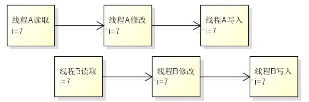

# 摘要

本文从并发出现的背景出发，介绍了并发执行方式解决了串行执行方式导致的资源利用率低的问题。并据此提出了只有当任务存在阻塞的前提下，使用并发才能带来系统资源利用率提升的效果。凡事都有两面性，使用并发在带来系统吞吐量提升的同时，也可能引入一些风险，本文对这些风险也进行了一些简单的讨论。

<!-- more -->

# 1 并发的出现

## 1.1 串行执行

早期的计算机主要用来执行逻辑简单但过程繁琐的数学计算任务。由于在物理环境下编程难度很大，每次使用时，全程只运行一个程序，执行一个任务，该任务独享所有系统资源。当有多个任务时，只能串行的一个一个执行。

**由于计算机不同组成部分之间的运行速度不同，在协同工作时，运行速度较快的模块需要等待运行速度较慢的模块完成计算后才能继续处理。**如磁盘、网络等外存，它们与CPU的处理速度差距甚至可以达到5个数量级的差距。

显然，对于一个需要外存参与的任务，与花费在外存I/O等待上的时间相比，实际用在任务计算上的时间甚至可以忽略不计了。因此，**在不改变串行执行方式的前提下，要想缩短多任务执行的总时长，只能缩短外存的I/O等待时间**。但即使是目前速度最快的固态硬盘，也无法将I/O时间缩短到与CPU指令执行时间同一个数量级。

CPU的长时间等待导致其利用率极低。自然地，人们希望CPU能够转而执行其他的计算任务，而不是浪费时间在等待上。

## 1.2 并发执行

基于对多任务能够同时执行的需求，就需要**一个能够对系统资源进行调度和分配的角色，它能对任务和资源进行管理，将资源合理的分配给所有任务。这个角色就是操作系统。**

操作系统对CPU的执行时间进行分片，并分配给每个程序使用。当一个程序A进入外存I/O等待或者使用完了本次分配的时间片，CPU就将程序A的执行现场保存下来，然后选择另一个待执行的程序B开始进行处理；当外存I/O处理就绪或者时间片使用权又轮到程序A时，CPU又将程序A的执行现场恢复回来，并从上次切出的地方开始继续执行，直到再次出现外存I/O等待或者分配的时间片用完或者程序A执行结束。

时间分片的运行方式，使得每个任务能交替地使用CPU资源。同时，当一个程序在等待的时候，可以先运行另一个程序，这无疑提高了CPU的资源利用率。

# 2 并发与并行的区别

**当多个任务在同一个CPU上通过时间分片的方式交替运行时，称为并发执行。当多个任务在多个CPU上同时进行计算时，称为并行执行。**

在一个单核CPU上，在编辑文本时还能播放音乐，在浏览网页时还能播放视频，这是并发机制在起作用；而在多核CPU上同样能完成这些工作，但这可能是由于并行执行引起的。

并发和并行的概念经常被混淆。由于并发执行引起的上下文切换所消耗的时间相比于人类可感知到的时间停顿来说很小，因此不论是并发还是并行，看起来都是多个任务在同时运行。

# 3 并发的优势及使用前提

任务的复杂程度不同，执行这些任务所需要的资源也不同，计算机中参与任务执行的组成部分也不同。对于计算10的阶乘这样的简单任务，只需要用到CPU和内存即可，甚至可以不需要内存参与，单纯由CPU也能完成；而对于比如银行报表统计这类数据量大，计算逻辑复杂的任务，除了CPU和内存外，还需要文件系统的参与，甚至可能还需要网络系统的参与。**根据执行任务所需的资源不同，使用串行和并发的方式来执行多任务，得到的总体性能效果也是不同的。**

串行执行不需要外部资源参与的多任务，执行总时间可表示为
$$
总时间=\sum任务计算时间
$$
并发执行不需要外部资源参与的多任务，执行总时间可表示为
$$
总时间=\sum(任务计算时间+上下文切换时间)
$$
串行执行需要外部资源参与的多任务，执行总时间可表示为
$$
总时间=\sum(任务计算时间+任务I/O等待时间)
=\sum(1+10^5)任务计算时间
$$
并发执行需要外部资源参与的多任务，执行总时间可表示为
$$
总时间=\sum(任务计算时间+上下文切换时间)
$$
上下文切换虽然也是一个比较重的操作，但相对于外存I/O来说，依然是有多个数量级的差距。

从上述结果可以看出，当执行任务不需要外部资源参与时，使用并发相比串行执行需要多付出上下文切换的性能开销，总的执行时间反而更长了；而对于需要外部资源参与的任务，在等待时间里切换并执行其他任务，能够更充分的利用CPU。

因此，对于CPU密集型的任务，串行执行的效率更高；对于I/O密集型的任务，并发执行的效率更高。可见，**使用并发能够提升系统资源利用率的前提在于，任务的执行需要依赖于外部速度较慢的资源**。

# 4 使用并发带来的风险

任务程序的并发执行，意味着CPU资源和内存资源将会被共享。在不考虑高速缓存的情况下，CPU的作用只是进行计算，同一时间只能处理一个任务的计算，不同任务的计算不会互相影响；而内存作为存储单元，会被多个任务共享，如果没有正确地控制各个任务的行为，那么就有可能出现不同任务错误地使用相同的内存区域，进而引发一些不可控的问题。

因此，**当内存被不同的程序错误地共享时，并发就可能导致问题。**如果能将任务分解为互不依赖的子任务来并发执行，那么就不会出现问题。当然，在实际问题中难免任务之间存在相互依赖的场景，因此，讨论使用并发可能出现的问题及其解决之道是有意义的。

## 4.1 安全性问题

当内存资源被共享时，最常见的就是安全性问题。安全性问题指的是并发执行任务的结果依赖于任务的执行时序。安全性问题来源于程序的并发运行及内存资源的读写共享。

使用自增操作符(++)对共享数据进行并发操作，经常被作为引入并发安全性问题概念的经典案例。这个案例十分简单但却很好的暴露出了安全性问题。

```java
private static int i = 0;

public void inc(){
    i++;
}
```

当并发地执行上述代码片段时，多个线程会并发地对共享变量i所在的内存地址进行可分割的"读取-修改-写入"操作，在特定的时序条件下，就可能出现部分线程的操作被覆盖的问题。



要解决安全性问题，只需要破坏导致安全性问题的任一条件即可。例如通过使用单线程运行破坏并发运行条件；通过创建不可变对象破坏读写共享条件；通过线程同步机制破坏读写共享条件；通过只读共享破坏读写共享条件。

## 4.2 活跃性问题

**活跃性问题是指并发执行的任务无法及时的执行下去。**活跃性问题常见于错误地使用了同步机制。活跃性问题是非常严重的问题，只能通过中止任务来进行恢复。并且这类问题都是在执行过程中动态的发生，一些代码检查工具也难以发现，因此排查十分的困难。

常见的活跃性问题有死锁，活锁，饥饿等。

### 4.2.1 死锁

死锁的典型案例是哲学家进餐问题。最简单的版本是两个哲学家去吃饭，他们时而思考时而吃饭。桌上只有两只筷子，分别放在他们的左右手边，只有拿到一双筷子才能吃东西，并且吃到东西后才会将筷子放回。假设两个人同时拿到了右边的筷子，然后开始等待左边的筷子空出来，但是因为他们还没有吃到东西，因此又不放下已经拿到的筷子。那么大家就只能这么无限等待下去。

**当多个任务互相拥有着对方所需的资源，又在等待着对方拥有的资源，并且在得到自己需要的所有资源之前不会放弃已拥有的资源，这种情况将产生死锁。**

在并发环境下，当一个线程获取到了锁A，并尝试继续获取锁B，同时，另一个线程已经获取到了锁B，并尝试继续获取锁A。此时，双方都拿着对方所需的资源等待对方的资源，并且在获取到锁AB并完成计算之前双方都不会放弃自己手中的资源。那么这两个线程将一直这么等待下去，直到有外力对这种关系进行破坏。

死锁问题一般是由于没有以统一固定的顺序获取多个锁。例如上例中的锁AB，如果在获取锁前都根据字母顺序进行获取，即先获取锁A再获取锁B，则死锁不会发生。在一些动态加锁的场景中，比如转账业务中对转账方和收款方进行的加锁操作，如果以先获取转账方的锁再获取收款方的锁的逻辑进行锁获取，则当两个账户相互转账时，就有可能发生动态的锁顺序死锁，可以先对转账双方账号进行排序，再根据排序顺序进行加锁，来保证多个线程加锁的顺序能一致。

### 4.2.2 活锁

**当多个相互协作的线程都对彼此进行响应从而修改各自的状态，并使得任何一个线程都无法继续执行时，就发生了活锁。**

在哲学家进餐问题中修改哲学家的行为，规定哲学家只能先拿左边的筷子，成功后再拿右边的筷子，并且如果右边的筷子没有拿到，那就将已拿到的筷子放回，然后重新尝试。那么可能出现这样的情况，两位哲学家同时拿起左边的筷子，同时发现右边没有筷子，同时放下左边的筷子，再同时拿起左边的筷子，这样循环往复下去，虽然他们一直有所动作，但是他们都无法完成进餐。

解决活锁的办法是引入随机等待。当因为没有获取到需要的资源而放弃已有的资源后，随机等待一段时间再开始进行重试。

### 4.2.3 饥饿

**当任务因为一直访问不到自己所需的资源时，就产生了饥饿问题。**

在哲学家进餐问题中修改哲学家的行为，规定哲学家在拿到一整双筷子后，就一直进餐，知道把桌上的东西都吃完。那么首先拿到一双筷子的哲学家在吃完东西之前都不会放弃筷子，也就导致另一位哲学家一直无法拿到筷子。

在并发环境下，如果一个线程在持有锁时执行一些无法结束的行为，如无限循环，那么其他需要这个锁的线程将永远无法得到它。

饥饿问题通常是由于一些依赖于具体执行平台的编码，比如指定线程优先级等。应该尽可能的避免这种编码，或显式的主动让出资源给优先级较低的线程，让它们有机会执行自己的任务。

## 4.3 性能问题

**性能问题是指不当使用并发导致的系统整体性能下降，吞吐量下降。**显然的，当用于上下文切换花费的时间多于任务实际执行的时间时，使用并发来解决问题，就是一种得不偿失的方案。

# 5 总结

当我们谈论并发时，更多的是在讨论如何充分的利用单个CPU资源。

使用并发来执行任务已经是当今不可避免的方式了。即使应用程序本身简单到只用到一个线程来执行，但在底层的运行时环境或者更基础的操作系统中，也一定还会有其他各式各样的后台任务在并发执行。

尽管现在硬件速度非常快、并且高级程序设计语言也对并发特性做了很多封装来降低编写并发程序的门槛、人们在进行程序设计时也会习惯性地对任务进行分解以期能以并发的方式来执行，但依然需要注意“无阻塞不并发”的原则。如果任务都只是计算，没有外部资源的等待，那么大可不必使用并发方式执行，即使不在乎几十毫秒的上下文切换开销，也应该意识到不使用并发就不会为程序编写引入更多的复杂性。